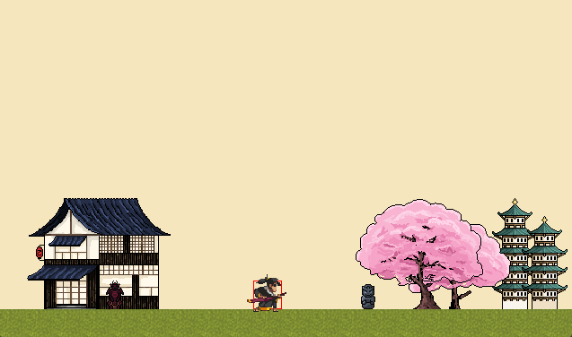

# Ichirei Shikon

## Screenshots

## Descrição

*Ichirei Shikon* é um jogo single-player de ação e aventura inspirado em jogos metroidvania com referências de  *Hollow Knight* e *Dark Souls* para criar uma atmosfera densa e introspectiva. A história mergulha o jogador na jornada de uma alma sem nome, amaldiçoada a reviver os pecados que cometeu em múltiplas vidas. Com uma narrativa focada em temas como redenção, culpa e o ciclo de vida e morte. Ao mesmo tempo, propõe uma experiência mais ágil e dinâmica, com mecânicas de movimentação fluida e combate tático que visam aprofundar a estratégia e a intensidade da ação.

O objetivo do jogador é desvendar a origem da maldição que o assola, revivendo vidas passadas para compreender o impacto real de suas ações. A jogabilidade é centrada em um sistema de combate preciso, que inclui ataques fracos e fortes, e um dash com frames de invencibilidade. O uso do dash é uma ferramenta crítica tanto para a mobilidade ofensiva quanto para a esquiva defensiva, exigindo que o jogador domine seu tempo de execução para superar os desafios. A progressão não se baseia apenas em atributos, mas na habilidade do jogador em dominar essas mecânicas.

A história começa quando o protagonista, após morrer em uma vida como um rebelde cyberpunk, desperta em um limbo melancólico. Guiado por um espírito misterioso — que mais tarde se revela ser a deusa Izanami, a quem ele assassinou em sua primeira vida — o jogador precisa reviver suas memórias. A jornada culmina em um confronto final contra o deus Izanagi, não por orgulho, mas para proteger o filho de Izanami, Kagutsuchi, e finalmente quebrar o ciclo de vingança e destruição. Não há uma condição de derrota tradicional; o avanço se dá pela superação dos desafios e pela conclusão do arco narrativo de redenção.

## Funcionalidades a serem testadas

Durante o playtesting, pedimos que observem com atenção as seguintes funcionalidades:

* **Movimentação básica:** Avaliar a fluidez e responsividade ao andar, correr e pular.
* **Sistema de combate:** Testar a eficácia e o balanceamento dos ataques fracos e fortes.
* **Mecânica de dash:** Observar o uso dos frames de invencibilidade para esquiva e posicionamento ofensivo.
* **Inimigos e IA:** Analisar o comportamento dos inimigos e o balanceamento geral da dificuldade.
* **Fluxo de jogo:** Observar a progressão entre as diferentes áreas e atos da história.
* **Interações:** Testar as interações com objetos do cenário e personagens não jogáveis (NPCs).
* **Feedback audiovisual:** Prestar atenção em como a trilha sonora e os efeitos sonoros contribuem para a experiência, especialmente os sons de impacto durante o combate.

## TODO
* Criar mais inimigos
* Corrigir morte de inimigos
* Trocar os sprites provisórios de cenário
* Adicionar animação de morte do jogador e inimigos
* Adicionar mais níveis

## **Importante**
É necessário adicionar **\$PROJECT_DIR\$** ao Working Directory do Clion IDE para que o jogo funcione corretamente.

Para isso, vá em **Run -> Edit Configurations** e adicione o diretório do projeto na opção Working Directory.

## Grupo
* Gustavo Dias Apolinário
* Leonardo Borges de Oliveira
* Lucas Albano Olive Cruz
* Mateus Gonçalves Moreira